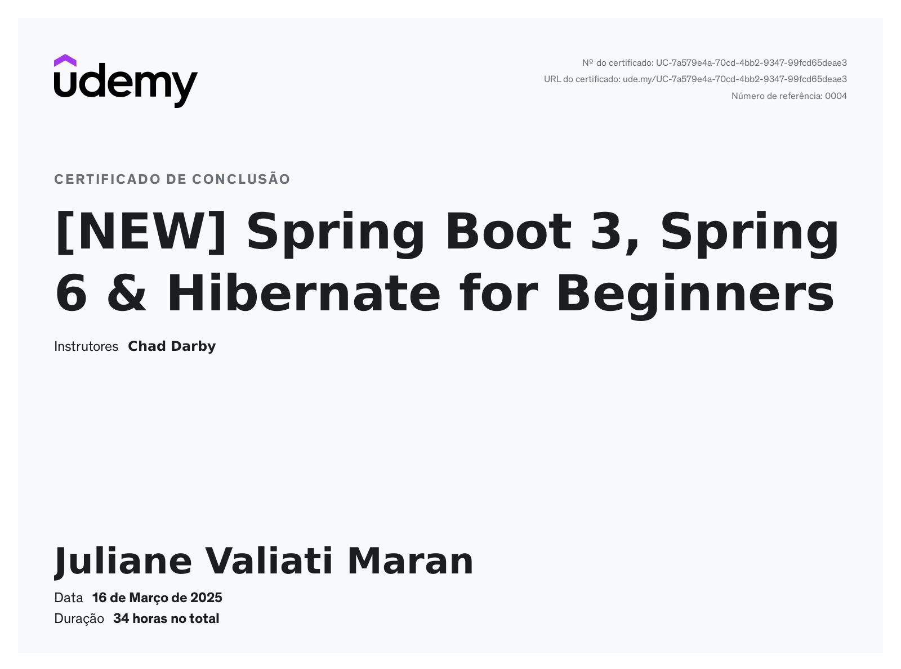

# Spring Boot 3, Spring 6 & Hibernate

## 🎯 Objetivo do Repositório

Este repositório contém o código-fonte do curso **[NEW] Spring Boot 3, Spring 6 & Hibernate for Beginners**. Ele foi criado para auxiliar no aprendizado e desenvolvimento de aplicações **Java** utilizando **Spring Boot** e **Hibernate**. Aqui você encontrará exemplos práticos e projetos que acompanham as aulas do curso.

## 📂 O que você encontrará neste repositório?

📌 Código-fonte completo das aulas.  
📌 Exemplos práticos de **Spring Boot** e **Hibernate**.  
📌 Implementação de **APIs REST, Spring MVC e operações CRUD**.  
📌 Projetos com **Spring Security** para controle de acesso.  
📌 Configurações baseadas em **Java e Maven** (sem XML).  
📌 Instruções para configuração do ambiente de desenvolvimento.

---

## 📥 Como clonar este repositório

Para obter o código-fonte do curso, siga os passos abaixo:

### 🔽 Clonando via Git

* Este repositório:

```sh
git clone https://github.com/JulianeMaran32/Java-with-Spring-Boot.git
```

* Repositório do Instrutor do Curso:

```sh
git clone https://github.com/darbyluv2code/spring-boot-3-spring-6-hibernate-for-beginners.git
```

⚠️ **Usuários do Windows**: Se encontrar erro **"File Names Too Long"**, use **7-Zip** ou execute:

* Este repositório:

```sh
git clone -c core.longpaths=true https://github.com/JulianeMaran32/Java-with-Spring-Boot.git
```

* Repositório do Instrutor do Curso:

```sh
git clone -c core.longpaths=true https://github.com/darbyluv2code/spring-boot-3-spring-6-hibernate-for-beginners.git
```

### 📥 Importando o projeto na sua IDE

Se estiver utilizando o **IntelliJ IDEA**, siga os passos:

1. **Abra o IntelliJ IDEA**.  
2. Clique em **File > Open**.  
3. Selecione a pasta do projeto clonado.  
4. Aguarde o IntelliJ carregar as dependências do Maven/Gradle.  
5. O projeto estará pronto para uso! 🚀  

Caso utilize outra IDE, como Eclipse ou VS Code, basta importar o projeto como um **projeto Maven**.

---

## 🚀 Breve Explicação sobre Spring e Spring Boot

**Spring Framework** é um dos frameworks mais populares para desenvolvimento de aplicações Java. Ele fornece um conjunto de funcionalidades para facilitar a criação de aplicações escaláveis e robustas.

**Spring Boot**, por sua vez, é uma extensão do Spring que simplifica o desenvolvimento de aplicações, eliminando configurações complexas e fornecendo um ambiente pronto para uso. Algumas das principais vantagens incluem:

✔ **Configuração automática** baseada no classpath;  
✔ **Gerenciamento simplificado de dependências** (Maven/Gradle);  
✔ **Servidor embarcado** (Tomcat, Jetty, Undertow);  
✔ **Facilidade na criação de APIs REST e integração com banco de dados**;  
✔ **Suporte a segurança e autenticação com Spring Security**.

---

## 📢 Conclusão

✔ Este repositório contém todo o código do curso **Spring Boot 3 e Hibernate**;  
✔ Você encontrará **projetos práticos e exemplos de API REST, Spring MVC e CRUD**;  
✔ Para começar, **clonar o repositório e importar na sua IDE**;  
✔ O curso ensina **Spring Boot de forma simplificada e eficiente**. 

## Certificado 

