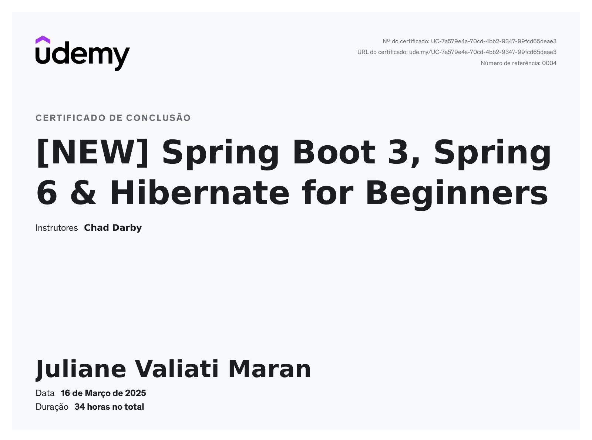

# Spring Boot 3, Spring 6 & Hibernate para Iniciantes

## Como clonar este repositório

Para obter o código-fonte do curso, siga os passos abaixo:

### Clonando via Git

* Este repositório:

```sh
git clone https://github.com/JulianeMaran32/Java-with-Spring-Boot.git
```

* Repositório do Instrutor do Curso:

```sh
git clone https://github.com/darbyluv2code/spring-boot-3-spring-6-hibernate-for-beginners.git
```

## Documentação

[Documentação - GitHub Wiki](https://github.com/JulianeMaran32/Java-with-Spring-Boot/wiki)

## Contribuição

Contribuições são bem-vindas! Consulte o guia completo de contribuições na
nossa [página de Contribuições](https://github.com/JulianeMaran32/Java-with-Spring-Boot/wiki/Contributing).

## 📜 Licença

Este projeto está licenciado sob a [Licença Apache 2.0](https://opensource.org/licenses/Apache-2.0).

## 📞 Contato

- **Email:** julianemaran@gmail.com
- **LInkedIn:** [Juliane Maran](www.linkedin.com/in/juliane-maran)
- **GitHub Repo:** [Java-with-Spring-Boot](https://github.com/JulianeMaran32/Java-with-Spring-Boot)

## 💡 Créditos

Este projeto foi inspirado pelo curso **"[NEW] Spring Boot 3, Spring 6 & Hibernate for Beginners"** disponível na
plataforma Udemy.

## 🔖 Versão

Versão atual: **1.0.0**

## 🔄 Última Atualização

Última atualização: **30 de março de 2025**

---

Para mais informações detalhadas sobre a configuração, consulte a
nossa [documentação avançada](https://github.com/JulianeMaran32/Java-with-Spring-Boot/wiki).

*Documentação gerada e mantida pela comunidade de desenvolvedores do projeto.*

---

## Certificado de Conclusão do Curso




